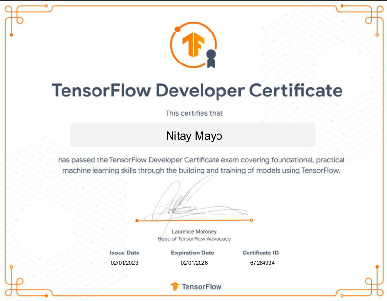

# Tensorflow Colab Notebooks

  This page showcases my skills and expertise in the field of machine learning and deep learning. The code you are about to see consists of a collection of Colab notebooks that I wrote during a complete Tensorflow course, and culminated in my passing the official Google Tensorflow developer exam with excellence.

  This is my collection of Colab notebooks that I put together during a 64-hour Tensorflow course I did online. These notebooks are a great showcase for my ability to learn and execute complex machine learning and deep learning concepts. During the course, I built and trained a whole range of models, from computer vision models to classification models, transfer learning models, NLP models, forecasting models and regression models. I think that the variety of models that I worked on really highlights my versatility as an AI enthusiastic and my ability to adapt to new challenges.

At the end of the course, I took the official Google Tensorflow developer exam and passed it with excellence. The certification is a widely recognized credential in the field of machine learning and deep learning, and passing the exam is a significant achievement that speaks to my mastery of Tensorflow, one of the most popular and widely used frameworks for building and deploying ML models. The exam is designed to test knowledge and practical skills in developing, training, and deploying models using Tensorflow, and passing it demonstrates that I have a deep understanding of the framework and its associated tools and techniques. Overall, my collection of Colab notebooks and the Tensorflow certification are a testament to my hard work and dedication in the field of Machine Learning.

<h2>My Tensorflow Developer Certificate</h2>

